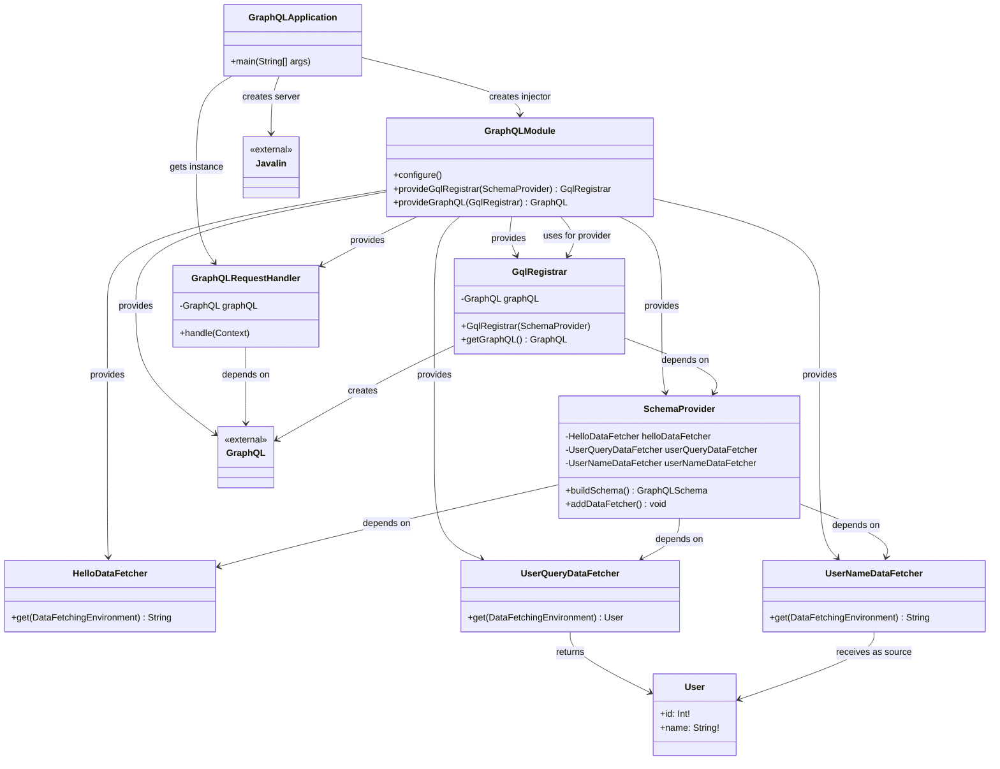

# GraphQL + Google Guice + Javalin Application

A lightweight GraphQL server built with Google Guice for dependency injection and Javalin as the web framework.

## Architecture Overview

```
┌─────────────────┐    ┌──────────────────┐    ┌─────────────────┐
│   GraphQL       │    │   Javalin        │    │   Google        │
│   Schema        │    │   Web Server     │    │   Guice DI      │
└─────────────────┘    └──────────────────┘    └─────────────────┘
         │                       │                       │
         └───────────────────────┼───────────────────────┘
                                 │
                    ┌─────────────────────┐
                    │  GraphQL Request    │
                    │     Handler         │
                    └─────────────────────┘
```

## Class Diagram



## Class Design

### 1. **GraphQLApplication** (Main Entry Point)
- **Purpose**: Application bootstrap and server startup
- **Responsibilities**:
  - Creates Guice injector with dependency configuration
  - Initializes Javalin web server
  - Registers GraphQL endpoint
  - Starts server on port 8080

### 2. **GraphQLModule** (Dependency Injection Configuration)
- **Purpose**: Guice module defining all dependency bindings
- **Responsibilities**:
  - Provides all application components as singletons
  - Configures GraphQL engine via provider methods
- **Key Providers**:
  - `GqlRegistrar` - GraphQL engine factory (Singleton)
  - `GraphQL` - GraphQL execution engine (Singleton)

### 3. **HelloDataFetcher** (GraphQL Resolver)
- **Purpose**: Implements GraphQL field resolver for "hello" query
- **Responsibilities**:
  - Returns greeting message for GraphQL "hello" field
  - Implements `DataFetcher<String>` interface

### 4. **UserQueryDataFetcher** (User Query Resolver)
- **Purpose**: Implements GraphQL field resolver for "getUser" query
- **Responsibilities**:
  - Fetches user data by ID
  - Returns User object with id, name, and age
  - Implements `DataFetcher<User>` interface

### 5. **UserNameDataFetcher** (Field-Level Resolver)
- **Purpose**: Implements GraphQL field resolver for "User.name" field
- **Responsibilities**:
  - Receives User object as source from UserQueryDataFetcher
  - Processes and returns formatted name string
  - Implements `DataFetcher<String>` interface

### 6. **SchemaProvider** (Schema Builder)
- **Purpose**: Creates executable GraphQL schema
- **Dependencies**: `HelloDataFetcher`, `UserQueryDataFetcher`, `UserNameDataFetcher` (injected)
- **Responsibilities**:
  - Parses GraphQL schema from `/schema.graphqls`
  - Wires schema types to data fetchers using `addDataFetcher` helper
  - Builds runtime wiring for Query and User types
  - Uses `TypeRuntimeWiring` list pattern for modular data fetcher registration

### 7. **GqlRegistrar** (GraphQL Engine Factory)
- **Purpose**: Creates and configures GraphQL execution engine
- **Dependencies**: `SchemaProvider` (injected)
- **Responsibilities**:
  - Builds GraphQL engine with executable schema
  - Provides GraphQL instance to other components

### 8. **GraphQLRequestHandler** (HTTP Request Handler)
- **Purpose**: Handles HTTP requests for GraphQL endpoint
- **Dependencies**: `GraphQL` (injected)
- **Responsibilities**:
  - Parses JSON request body
  - Extracts query, variables, and operation name
  - Executes GraphQL query with proper error handling
  - Returns JSON response with data or errors

### 9. **User** (Generated Type)
- **Purpose**: Represents User entity in GraphQL schema
- **Properties**:
  - `id: Int!` - Non-null user identifier
  - `name: String!` - Non-null user name (resolved by UserNameDataFetcher)
  - `age: Int!` - Non-null user age

## Dependency Flow

```
HelloDataFetcher ──┐
UserQueryDataFetcher ──┼─→ SchemaProvider → GqlRegistrar → GraphQL → GraphQLRequestHandler
UserNameDataFetcher ──┘
```

**Field Resolution Flow:**
```
UserQueryDataFetcher → User Object → UserNameDataFetcher
                    (source)      (field resolver)
```

1. **HelloDataFetcher, UserQueryDataFetcher & UserNameDataFetcher**: Created by Guice as singletons
2. **SchemaProvider**: Injected with all data fetchers, builds executable schema with field-level resolvers
3. **GqlRegistrar**: Injected with SchemaProvider, creates GraphQL engine
4. **GraphQL**: Provided by GqlRegistrar via provider method
5. **GraphQLRequestHandler**: Injected with GraphQL, handles HTTP requests
6. **Field Resolution**: UserQueryDataFetcher returns User object, which becomes source for UserNameDataFetcher

## File Structure

```
src/main/
├── java/org/deepak/
│   ├── GraphQLApplication.java          # Main application entry point
│   ├── GraphQLModule.java               # Guice DI configuration
│   ├── GqlRegistrar.java               # GraphQL engine factory
│   ├── handlers/
│   │   └── GraphQLRequestHandler.java   # HTTP request handler
│   └── graphql/
│       ├── resolver/
│       │   ├── field/
│       │   │   ├── HelloDataFetcher.java    # Hello query resolver
│       │   │   └── UserNameDataFetcher.java # User name field resolver
│       │   └── query/
│       │       └── UserQueryDataFetcher.java # User query resolver
│       └── schema/
│           └── SchemaProvider.java      # Schema builder
└── resources/
    └── schema.graphqls                  # GraphQL schema definition
```

## GraphQL Schema

```graphql
type Query {
    hello: String
    getUser(id: Int!): User
}

type User {
    id: Int!
    name: String!
    age: Int!
}
```

## API Endpoints

**POST** `/graphql`

### Hello Query
**Request Body**:
```json
{
  "query": "{ hello }"
}
```

**Response**:
```json
{
  "data": {
    "hello": "Hello GraphQL from Guice + Javalin!"
  }
}
```

### User Query
**Request Body**:
```json
{
  "query": "query GetUser($id: Int!) { getUser(id: $id) { id name } }",
  "variables": {
    "id": 123
  }
}
```

**Response**:
```json
{
  "data": {
    "getUser": {
      "id": 123,
      "name": "name 123 (age: 10)",
      "age": 10
    }
  }
}
```

### Alternative User Query (Inline)
**Request Body**:
```json
{
  "query": "{ getUser(id: 123) { id name age } }"
}
```

## Google Guice Integration

This project leverages Google Guice as a lightweight dependency injection framework to manage object creation and wiring. The `GraphQLModule` extends `AbstractModule` and defines provider methods annotated with `@Provides` and `@Singleton` to create expensive objects like `GqlRegistrar` and `GraphQL` as singletons, ensuring they're created once and reused throughout the application lifecycle. Constructor injection is used via Lombok's `@RequiredArgsConstructor(onConstructor_ = @Inject)` annotation, which automatically generates constructors with `@Inject` for dependency injection. This approach eliminates manual object instantiation, reduces boilerplate code, and creates a clean dependency graph where `SchemaProvider` receives data fetchers, `GqlRegistrar` receives the schema provider, and `GraphQLRequestHandler` receives the GraphQL engine - all wired automatically by Guice at runtime.

## Key Technologies

- **Javalin**: Lightweight web framework for HTTP server
- **Google Guice**: Dependency injection framework
- **GraphQL Java**: GraphQL implementation for Java
- **Lombok**: Reduces boilerplate code with annotations

## Running the Application

1. Start the server: `java -jar target/graphql-service.jar`
2. Server runs on: `http://localhost:8080`
3. GraphQL endpoint: `http://localhost:8080/graphql`

## Design Benefits

- **Separation of Concerns**: Each class has a single responsibility
- **Dependency Injection**: Loose coupling via Guice
- **Testability**: Easy to mock dependencies for unit testing
- **Scalability**: Easy to add new GraphQL resolvers and schema types
- **Performance**: Eager singletons for expensive operations (schema parsing)